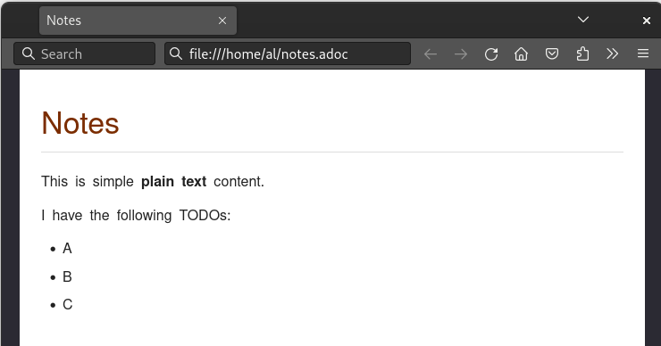

= Learning: AsciiDoc

Resources for learning documentation-as-code concepts using the AsciiDoc markup language.

* https://asciidoctor.org/
* https://docs.asciidoctor.org/
* https://en.wikipedia.org/wiki/AsciiDoc

== General workflow

Write down content in a simple text file using your favorite editor.

.file: notes.adoc
----
Notes

This is simple plain text content.

I have the following TODOs:

A
B
C
----

Add some AsciiDoc markup to your text.

.file: notes.adoc
----
= Notes

This is simple *plain text* content.

I have the following TODOs:

* A
* B
* C
----

Preview your document in your web browser with the https://docs.asciidoctor.org/browser-extension[browser extension].

Render your document to a publishing format like HTML or PDF.

[source, bash]
----
$ ./container/run.sh

$ asciidoctor notes.adoc
$ asciidoctor-pdf notes.adoc

$ ls
notes.adoc notes.html notes.pdf

----

== Additional resources

Examples written in Asciidoc

* https://docs.asciidoctor.org
* https://git-scm.com/book
* https://github.com/andreaslongo/asciidoctor-diagram-hugo-docsy

== Glossary

AsciiDoc::
The markup language.
You write your text files in the AsciiDoc format.

Asciidoctor::
A tool for converting AsciiDoc to publishing formats like e.g. HTML and PDF.
